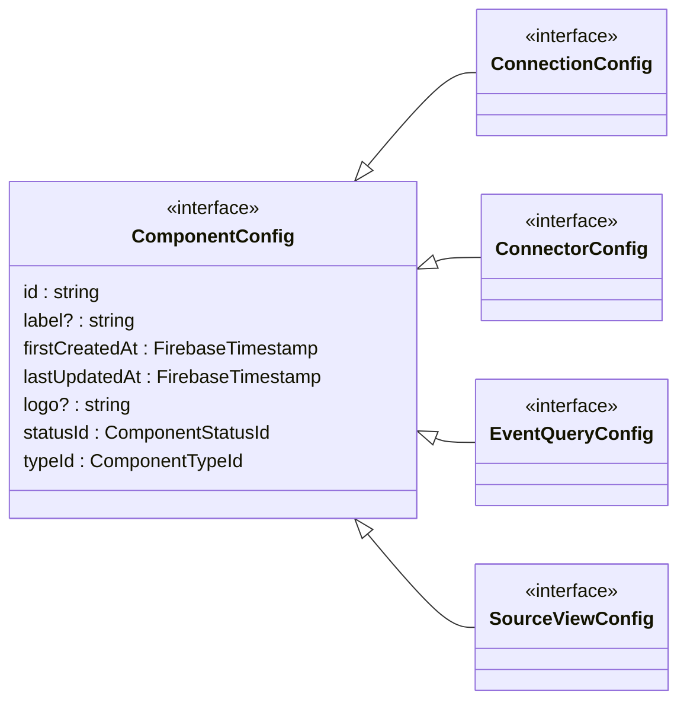
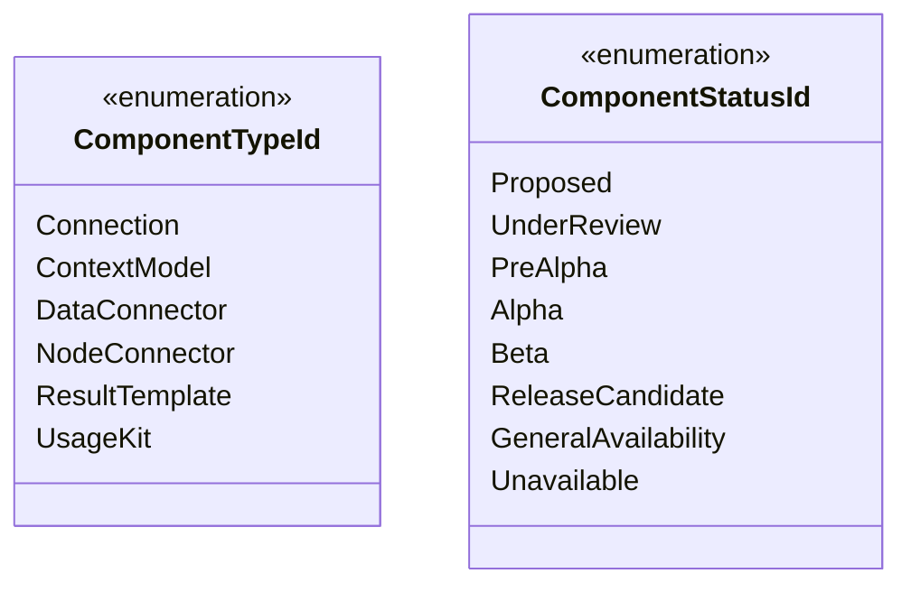
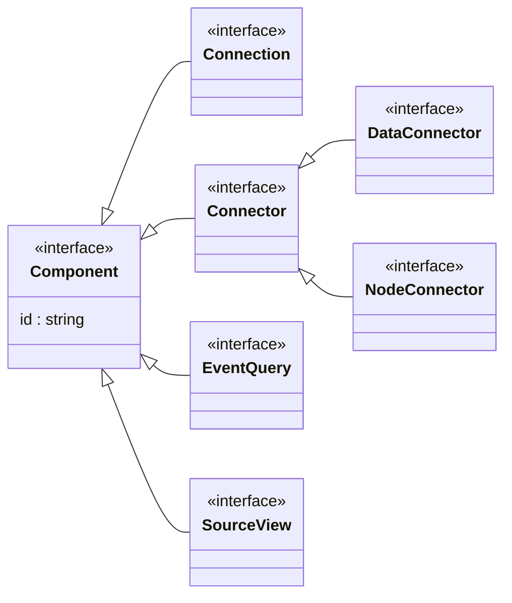
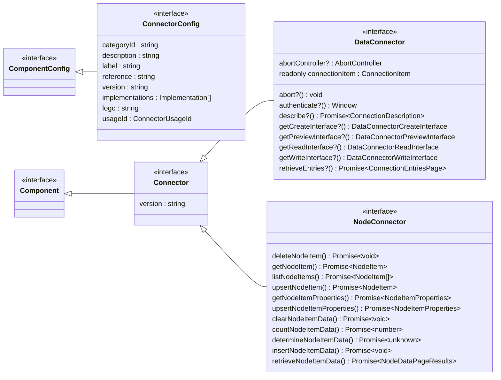
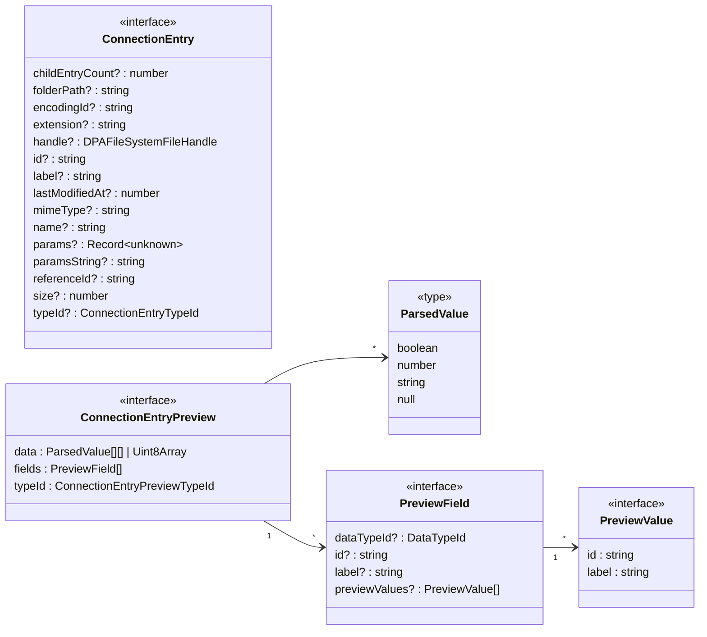
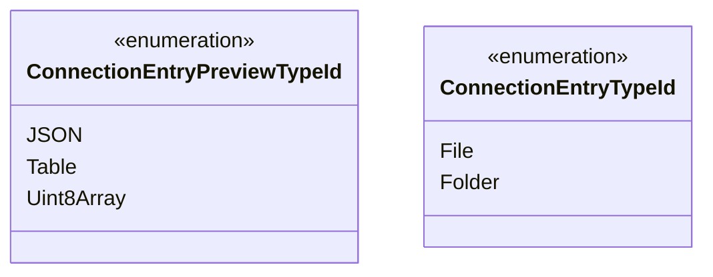
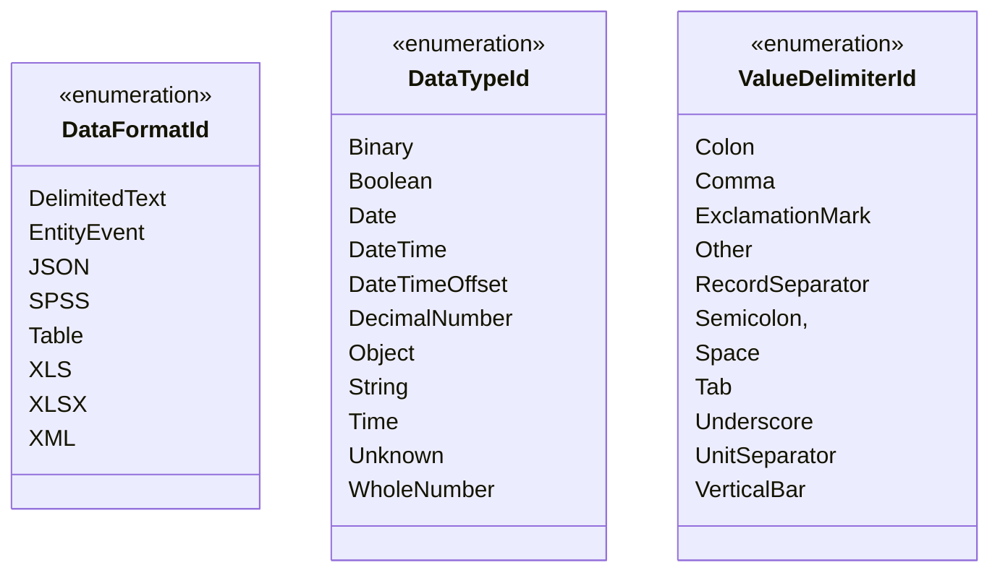
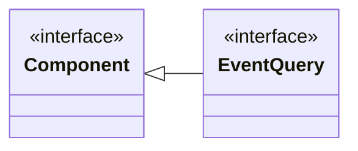
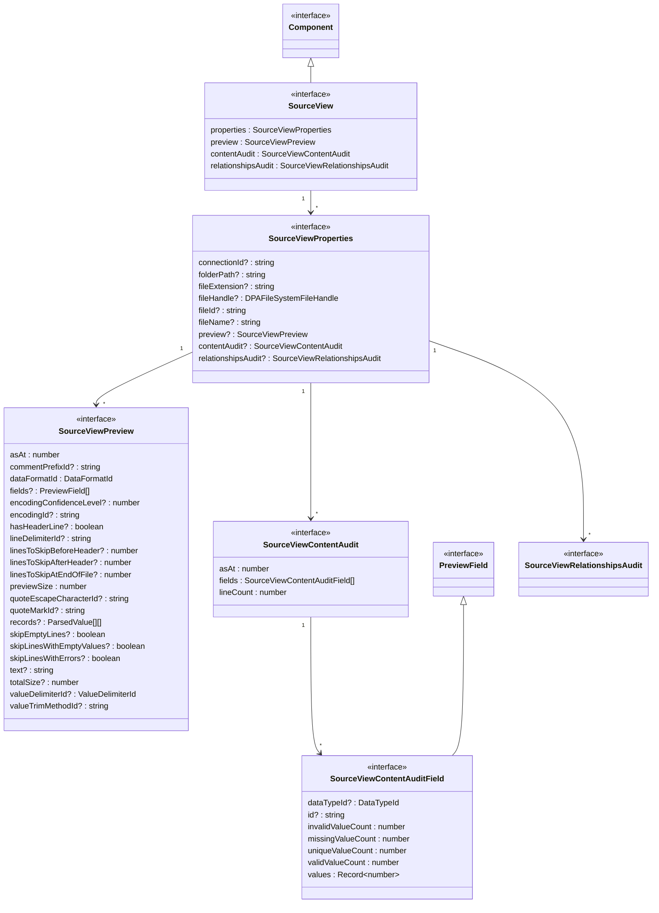

# Data Positioning Engine Support

Includes TypeScript declarations used by the Data Positioning engine, as well as utilities that provide assistance when utilizing the engine.

## Component Configuration Classes

The following diagram details the component configuration class hierarchy, showcasing the relationships and inheritance structure between different **Component Configuration** classes.

## Component Classes

The following diagram details the component class hierarchy, showcasing the relationships and inheritance structure between different **Component** classes.

## Connector Classes

The following diagram details the connector class hierarchies, showcasing the relationships and inheritance structure between different **Connector Configuration** and **Connector** classes.

## Connection Entry Classes

The following diagram illustrates the connection entry class hierarchy, showcasing the relationships and inheritance structure between different **Connection Entry** classes and detailing referenced enumeration types.

## Entity Event Class

...

## Source View Class

...

