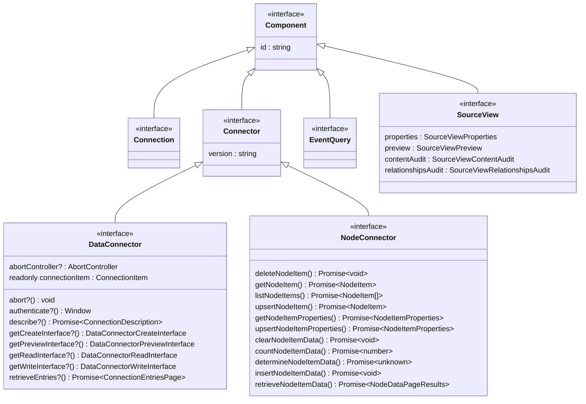
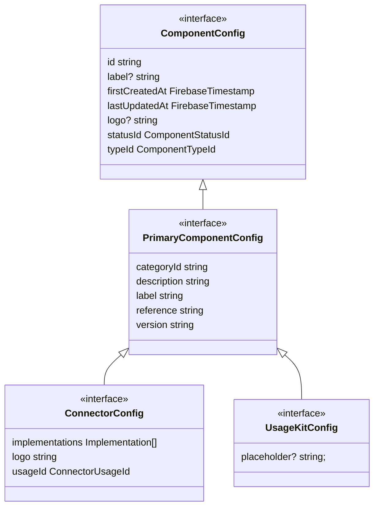
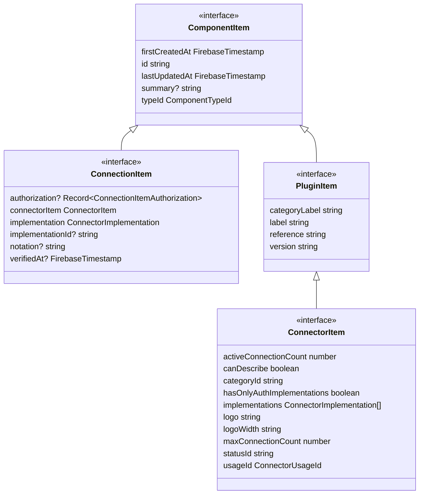
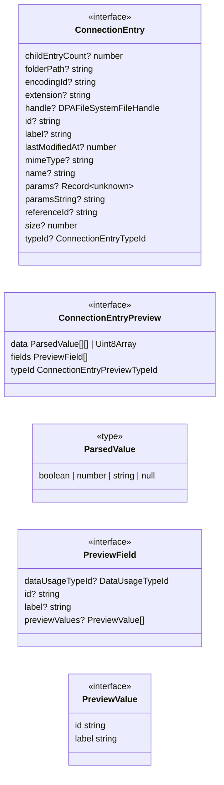
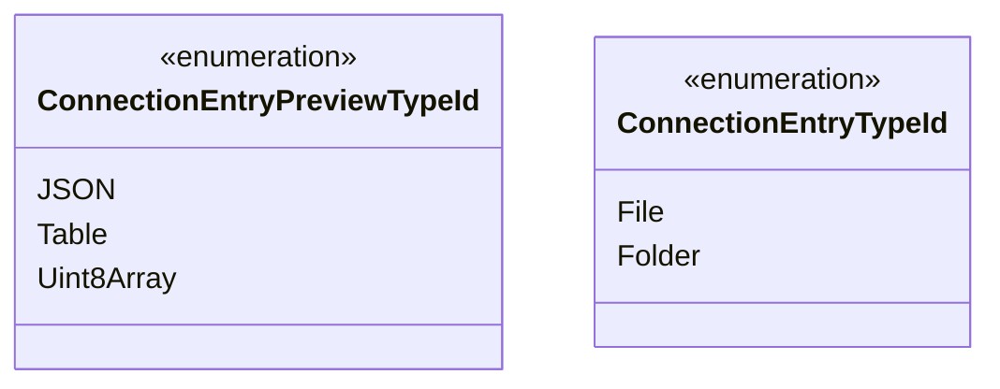
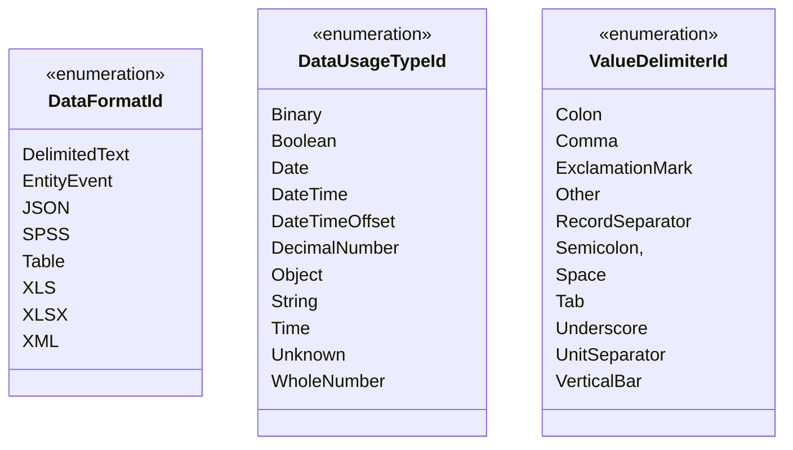

# Data Positioning Engine Support

## Component Class Hierarchy

## Component Configuration Class Hierarchy

## Component Item Class Hierarchy

## Connection Entry Class Hierarchy

## Connection Entry Enumerations

