# Data Positioning Engine Support

Includes TypeScript declarations used by the Data Positioning engine, as well as utilities that provide assistance when utilizing the engine.

## Component Configuration Declarations

The following diagram illustrates the component configuration class hierarchy, showcasing the relationships and inheritance structure between different **Component Configuration** classes.

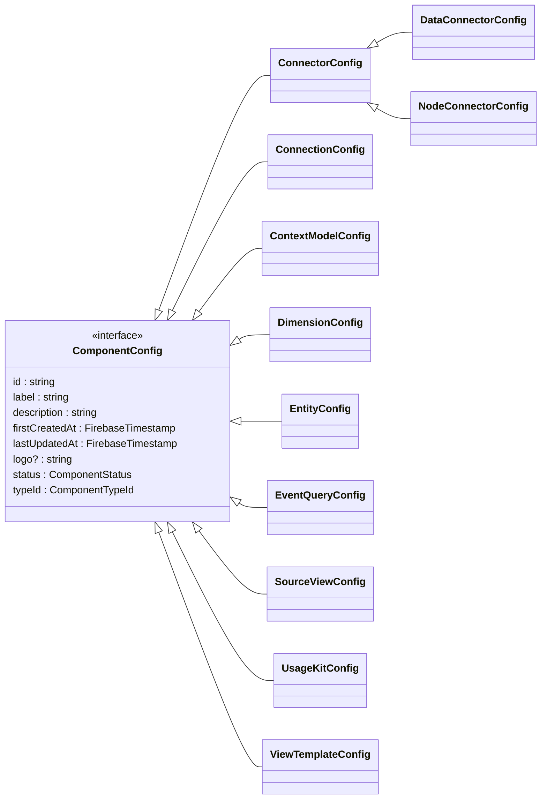

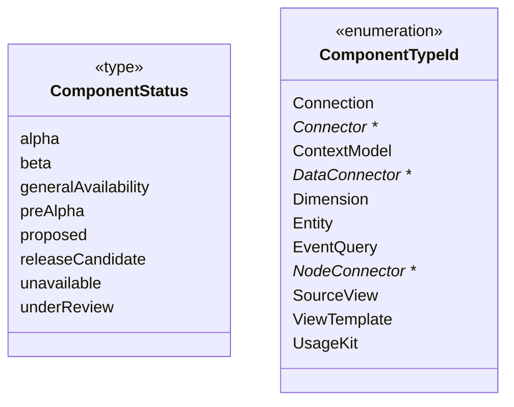

## Component Instance Declarations

The following diagram illustrates the component class hierarchy, showcasing the relationships and inheritance structure between different **Component** classes.

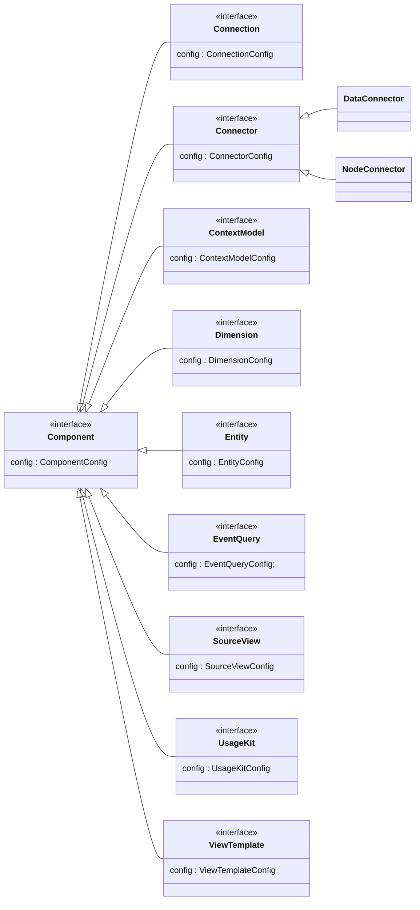

## Connector Configuration Declarations

The following diagram illustrates the connector class hierarchies, showcasing the relationships and inheritance structure between different **Connector Configuration** classes and detailing referenced enumeration types.

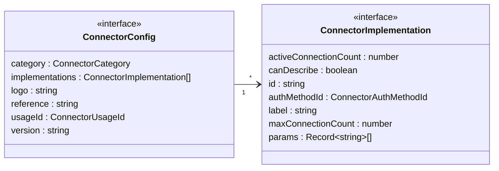

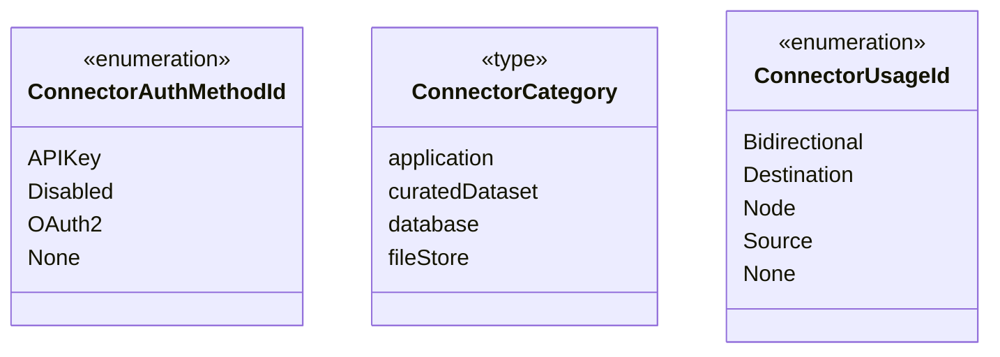

## Data Connector Instance Declarations

The following diagram illustrates the connector class hierarchies, showcasing the relationships and inheritance structure between different **Data Connector** classes and detailing referenced enumeration types.

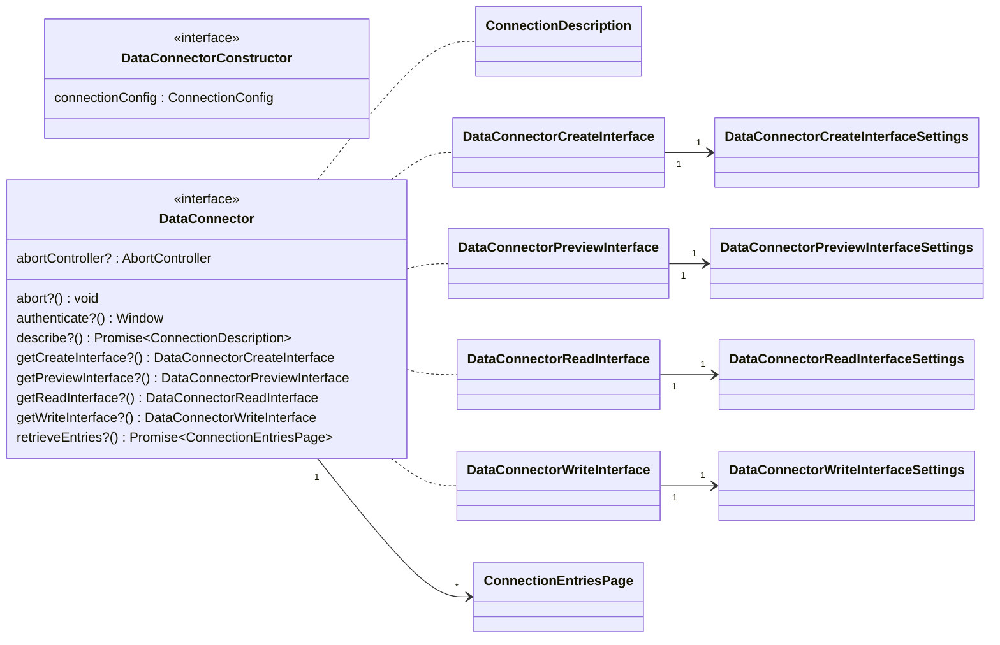

## Node Connector Instance Declarations

The following diagram illustrates the connector class hierarchies, showcasing the relationships and inheritance structure between different **Node Connector** classes and detailing referenced enumeration types.

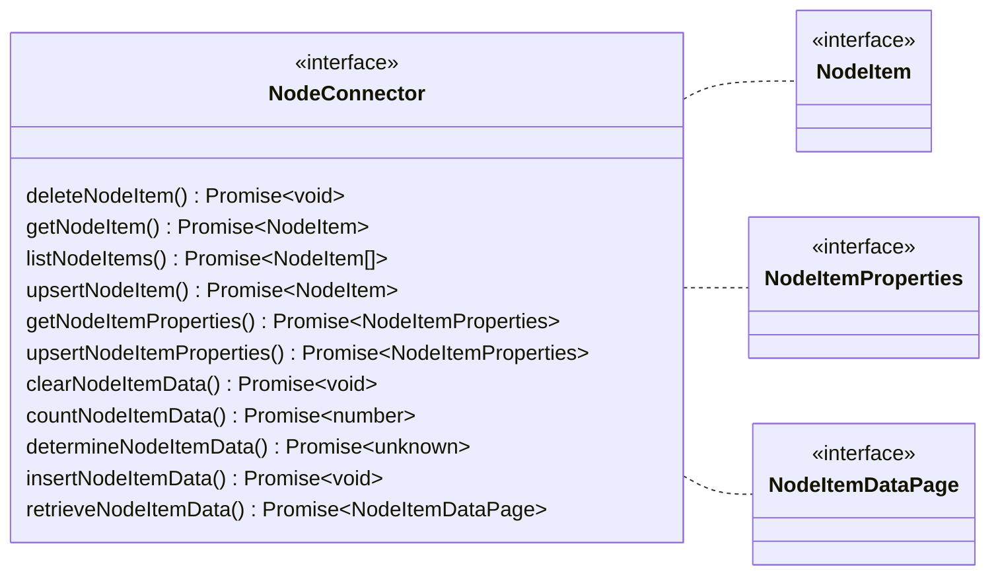

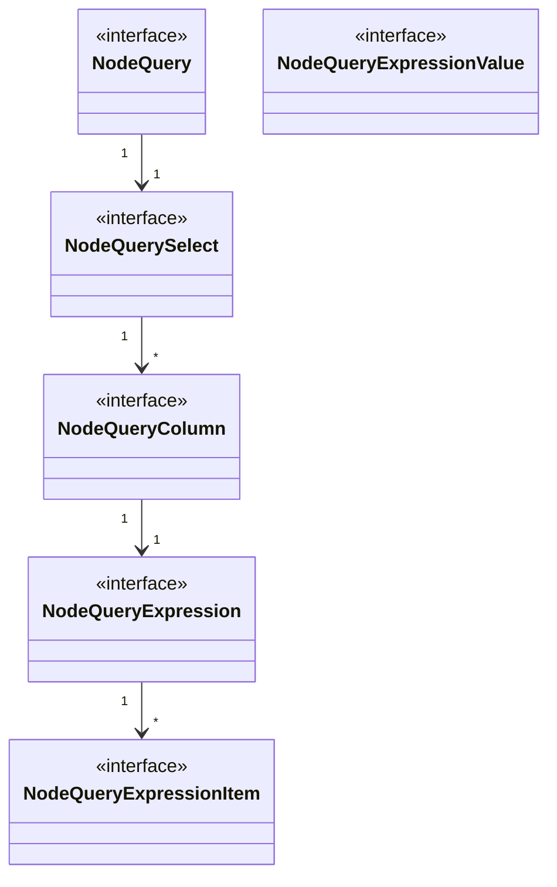

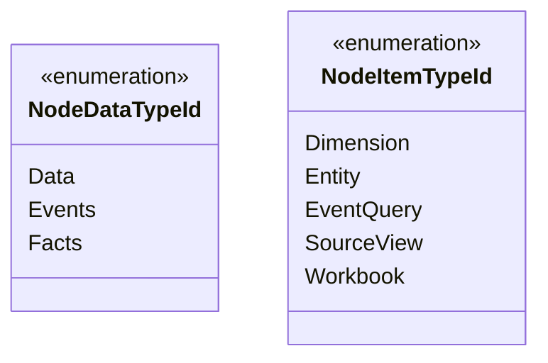

## Connection Declarations

The following diagram illustrates the connection class hierarchy, showcasing the relationships and inheritance structure between different **Connection** classes and detailing referenced enumeration types.

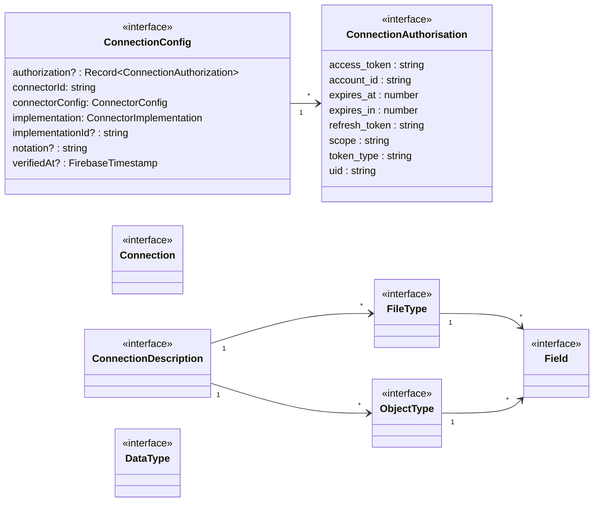

## Connection Entry Declarations

The following diagram illustrates the connection entry class hierarchy, showcasing the relationships and inheritance structure between different **Connection Entry** classes and detailing referenced enumeration types.

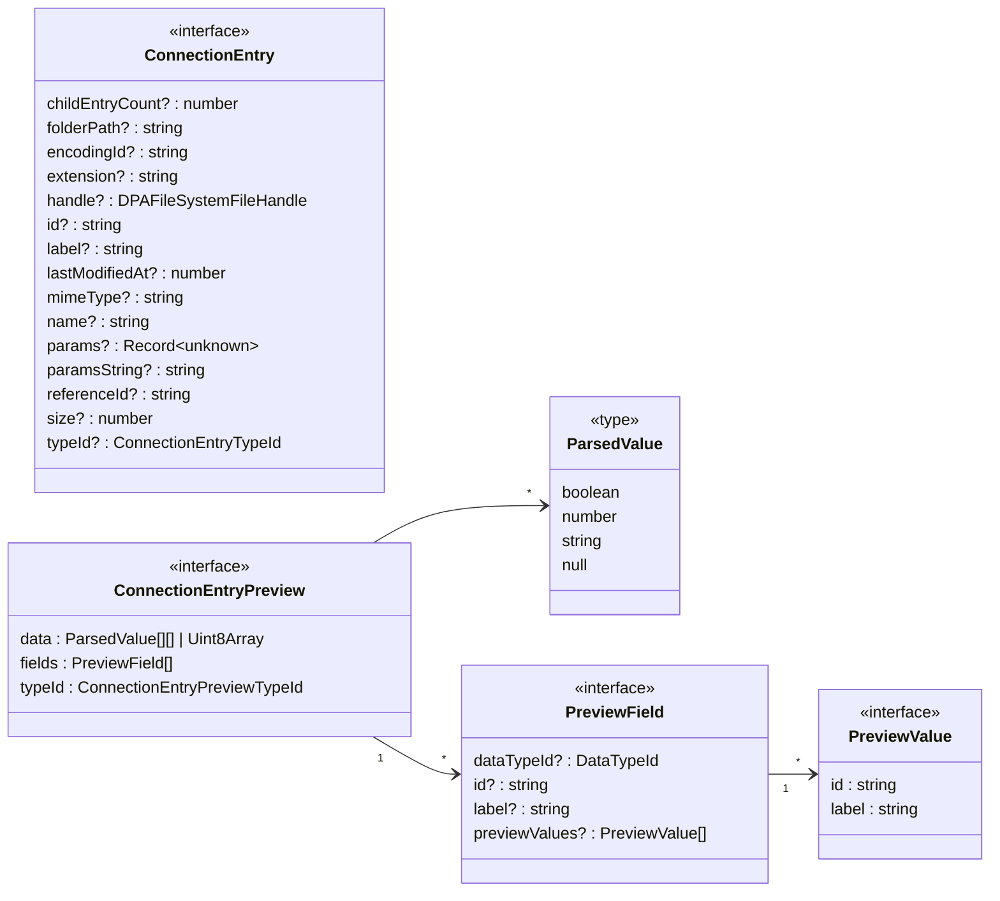

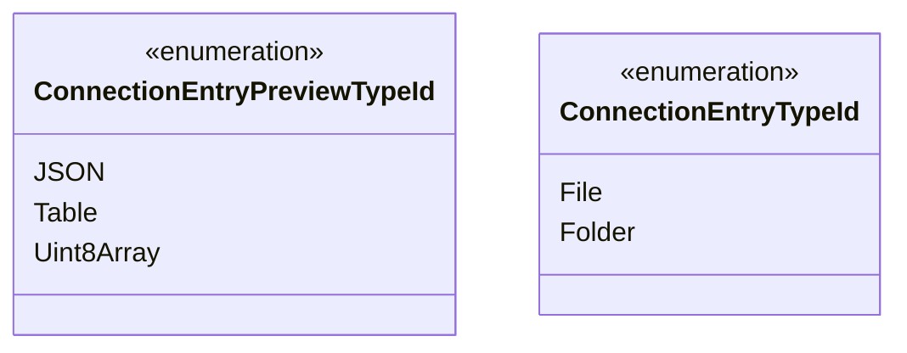

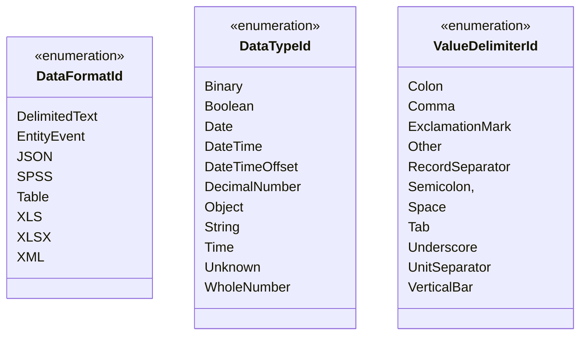

## Context Model Declarations

...

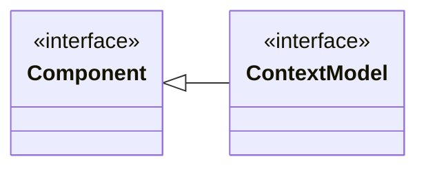

## Dimension Declarations

...

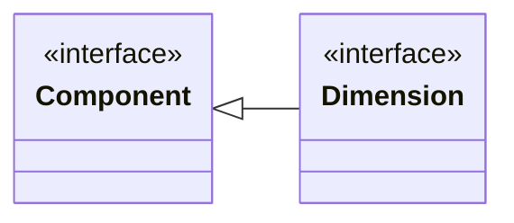

## Entity Declarations

...

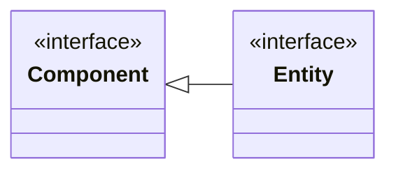

## Event Query Declarations

...

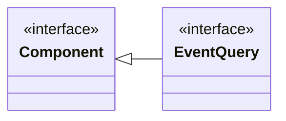

## Source View Declarations

...

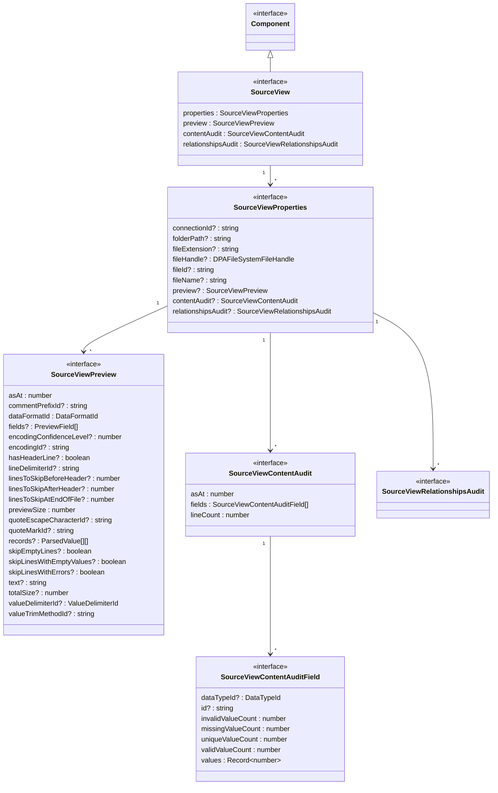

## Usage Kit Declarations

...

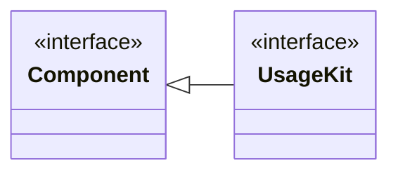

## View Template Declarations

...

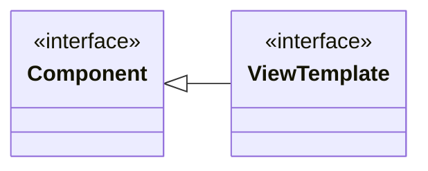

## Other Declarations

```mermaid
classDiagram
    direction TB

    class CallbackProperties {
        <<interface>>
    }

    class DataStorageTypeId {
        <<enumeration>>
        Binary
        Boolean
        Byte
        Date
        DateTime
        DateTimeOffset
        Decimal
        Double
        Int8
        Int16
        Int32
        Int64
        Object
        Single
        String
        Time
        Unknown
    }

    class DataUsageTypeId {
        <<enumeration>>
        Binary
        Boolean
        Date
        DateTime
        DateTimeOffset
        DecimalNumber
        Object
        String
        Time
        Unknown
        WholeNumber
    }

    class DPAFileSystemFileHandle {
        <<interface>>
    }
```

```mermaid
classDiagram
    direction TB

    class ErrorData {
            <<interface>>
        body : ErrorDataBody
        statusCode? : number
        statusText? : string
    }

    class ErrorDataBody {
            <<interface>>
        context? : string
        message : string
        stack? : string
    }

    class FirebaseTimestamp {
        <<interface>>
    }

    class Progress {
        <<interface>>
    }
```

## Utilities

### Conversion

-   convertODataTypeToDataType

### Extraction

-   extractDirectoryPathFromEntryPath
-   extractExtensionFromEntryPath
-   extractLastFolderNameFromFolderPath

### Formatting

-   formatNumberAsDecimalNumber
-   formatNumberAsStorageSize
-   formatNumberAsWholeNumber

### Lookup

-   lookupMimeTypeForFileExtension

### Security

-   establishVendorAccessToken

## Repository Management Commands

The following list details the common repository management commands implementation for this project. For more details, please refer to the [Grunt](https://gruntjs.com/) configuration file (gruntfile.js) in this project.

| Name        | Key Code         | Notes                                                                                                                                                                                                       |
| ----------- | ---------------- | ----------------------------------------------------------------------------------------------------------------------------------------------------------------------------------------------------------- |
| Audit       | alt+ctrl+shift+a | Audit the project's dependencies for known security vulnerabilities.                                                                                                                                        |
| Build       | alt+ctrl+shift+b | Build the package using Vite build.                                                                                                                                                                         |
| Check       | alt+ctrl+shift+c | List the dependencies in the project that are outdated.                                                                                                                                                     |
| Document    | alt+ctrl+shift+d | Identify the licenses of the project's dependencies.                                                                                                                                                        |
| Format      | alt+ctrl+shift+f | NOT implemented.                                                                                                                                                                                            |
| Lint        | alt+ctrl+shift+l | Check the code for potential errors and enforces coding styles.                                                                                                                                             |
| Migrate     | alt+ctrl+shift+l | Install the latest version of outdated dependencies.                                                                                                                                                        |
| Publish     | alt+ctrl+shift+n | Publishes the package to the [npm](https://www.npmjs.com/) registry. This action will publish the last synchronised version. Use the command line command 'npm publish' when publishing for the first time. |
| Release     | alt+ctrl+shift+r | Synchronise the local repository with the main GitHub repository and deploy the package to the Firebase hosting servers.                                                                                    |
| Synchronise | alt+ctrl+shift+s | Synchronise the local repository with the main GitHub repository.                                                                                                                                           |
| Test        | alt+ctrl+shift+l | NOT implemented.                                                                                                                                                                                            |
| Update      | alt+ctrl+shift+l | Install the latest version of outdated Data Position package dependencies.                                                                                                                                  |
